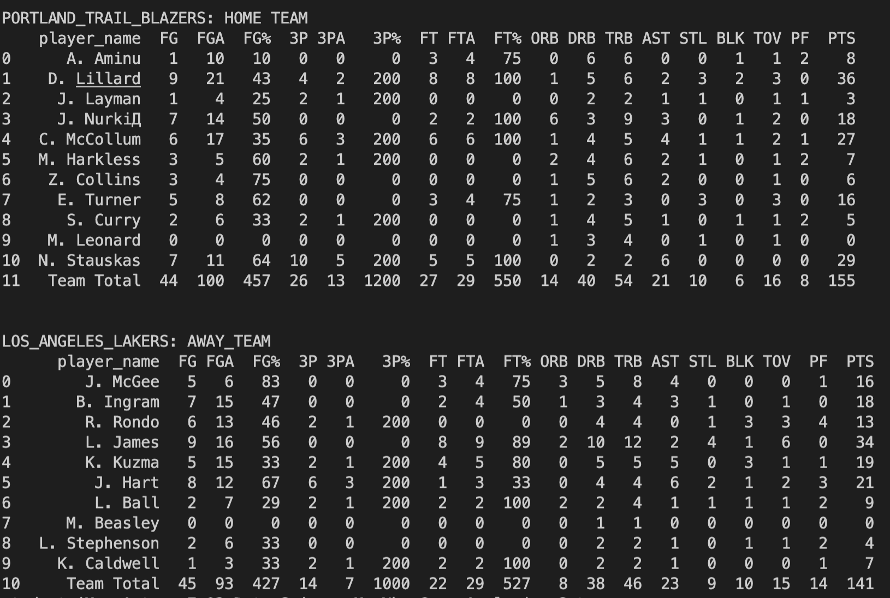

# My Nba Game Analysis

## Task

The task is to analyze the entire basketball game

## Description

We must analyze the entire basketball game, divide the players into teams
and analyze their characteristics in the game and calculate the total number of characteristics.
## Installation

We must install all the necessary libraries.
```
    pip install pandas
```
Here is the dataset, if you want you can upload your own dataset and yes the date should be in `.txt` format. Just remember to change the name in the code.

[data_1](https://storage.googleapis.com/qwasar-public/nba_game_warriors_thunder_20181016.txt)

[data_2](https://storage.googleapis.com/qwasar-public/nba_game_blazers_lakers_20181018.txt)


## Usage

After downloading all the necessary files and libraries, you can start coding. You only need to run the code if you have loaded your dataset then you must change the file names in the code for the code to work correctly.

If you did everything correctly, you should see something like this in your terminal ->



## Help

If you have any questions you can write to me by email

> mirabbosminavarov@gmail.com